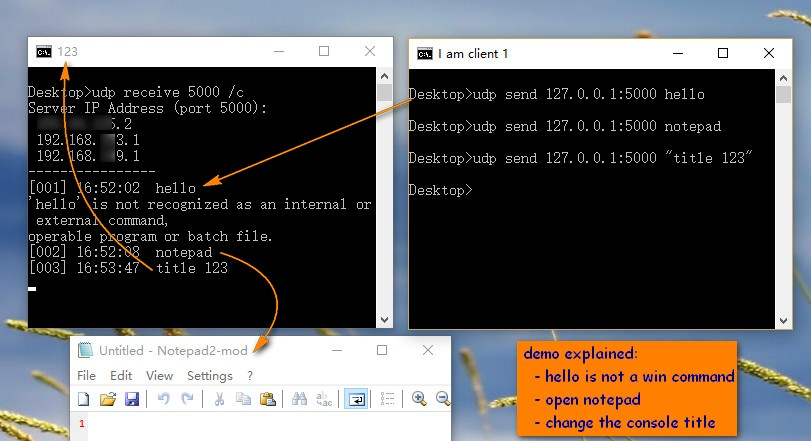

### udp-win
Udp socket tool for windows. Include server and client.

---
### How to use
**Create a udp server to receive messages**

`udp receive port [/c|/ca cmd]`

- `receive` necessary
- `port` the port to be bond for udp communication
- `[/c|/ca cmd]` regard received message as a command (`/c`), command argument (`/ca`) for `cmd`, or plain text if not specified.

**udp client to send message**

`udp send ipaddr:port msg`
- `send` necessary
- `ipaddr` server ip address
- `port` server opened udp port
- `msg` the text message to send

### Tip
When `udp receive`  all the server ip addresses are prompted, which should contain the correct ip address (except localhost sometimes) for the `udp send`.

### Demo
demo `udp receive port`

demo `udp receive port /c`

### Download
You can compile your own executable through the source code, or directly use my compiled version from below link.

[Download from here](release/udp.exe) ~ around 17.0k

Note it was compiled under _.net framework 3.5 x86_ , therefore should be compatible with `Win7` and above for both `x86/x64`.

